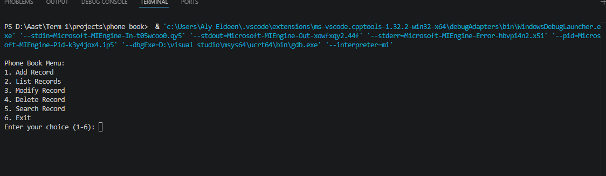
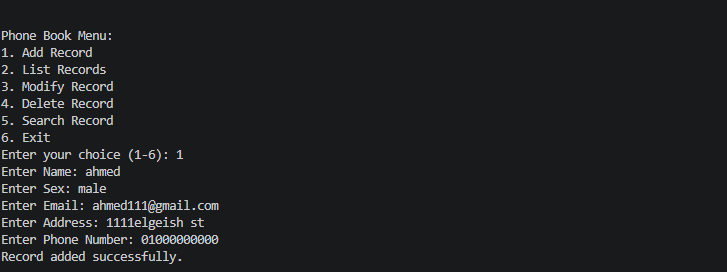
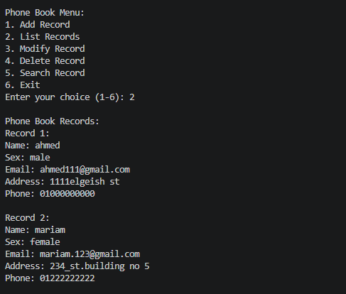
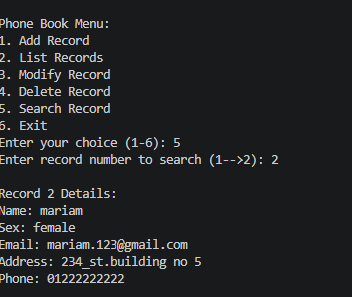

# Phone Book Management System 📱

A simple, fast, and lightweight console-based Phone Book application written in C. This project allows users to efficiently manage their contacts through a straightforward command-line interface.

## 🚀 Features

The application supports the following operations:
* **Add Record:** Create a new contact with details including Name, Sex, Email, Address, and Phone Number.
* **List Records:** View all saved contacts in a well-formatted list.
* **Modify Record:** Update the details of an existing contact using their record number.
* **Delete Record:** Remove a contact from the phone book.
* **Search Record:** Look up a specific contact's details using their record number.

## 📸 Screenshots

**1. Main Menu Interface**



**2. Adding a New Record**



**3. Listing All Records**



**4. Searching / Modifying a Record**


## 🛠️ Technologies Used

* **Language:** C Programming Language
* **Core Concepts:** Structs, Arrays, Standard I/O operations, Control Structures.

## 💻 How to Run

1. Make sure you have a C compiler installed (like GCC).
2. Open your terminal or command prompt.
3. Navigate to the directory where the file is located.
4. Compile the code using the following command:
   ```bash
   gcc phone_book_project.c -o phonebook
